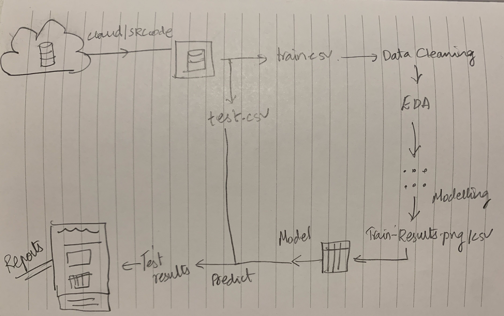
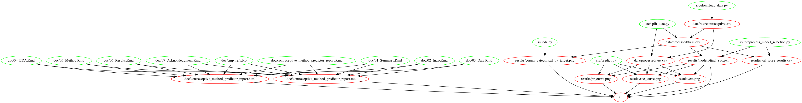

# Contraceptive Method Predictor

-   Authors: Christopher Alexander, Yik Hong Chan, Abhiket Gaurav, Valli A

A data analysis project to predict the contraceptive method choice of a woman based on her demographic and socio-economic characteristics.

## About

In this project we are trying to answer the question: given the the demographic and socio-economic status are we able to predict the contraceptive method preferred by the individual? Answering this question is important because of the adverse effects contraceptive's can have on a person's health based on the usage. Furthermore, it also gives us an understanding of the factors that could have contributed to the reasons behind why the contraceptive market is such a big industry in the health care sector right now.

The data set used in this project is a subset of the 1987 National Indonesia Contraceptive Prevalence Survey created by Tjen-Sien Lim. It was sourced from UCI Machine Learning Repository and can be found [here](http://archive.ics.uci.edu/ml/datasets/Contraceptive+Method+Choice). Each row in the dataset represents the demographics and social economic status of a woman in Indonesia (e.g., Age, Education, Religion, Standard of living index,etc.).

To answer the predictive question posted above , we plan to build a predictive classification model. Before model building we will partition the data into training and test (70%:30%) and perform exploratory data analysis to understand various questions such as class imbalance, correlation, distribution of variables,etc. We will also find initial patterns we observe from the data which can help us in the model building process.

Given there are not enough samples for short term use and long term use of contraceptives, we would approach this problem as a binary classification problem. The levels of our target i.e `choice of contraceptive method` have been categorized into: 0=No Use, 1=Use of contraceptives. We will use accuracy and recall score as our evaluation metric as we have categorized the target into 2 labels.

After selecting our final model, we will refit the model on the complete training data set, and evaluate its performance on unseen test data set. An overall performance of the model with mis-classification errors will be presented in the form of a classification report.

An initial exploratory data analysis performed as a part of the release v0.0.1 can be found [here](https://github.com/UBC-MDS/contraceptive_method_predictor/blob/main/src/eda.ipynb).

The workflow and code implementation was perfomed as a part of the release v0.1.0 can be found [here](https://github.com/UBC-MDS/contraceptive_method_predictor/releases/tag/v0.1.0).

The final report for the project can be found at https://github.com/UBC-MDS/contraceptive_method_predictor/blob/main/doc/contraceptive_method_predictor_report.md

## Data Analysis Workflow

In this project, we created 6 scripts to run our data analysis. As illustrated in the figure below.



1.  **src/download_data.py** - A first script that downloads the data from the UCI repository and saves it as a csv
2.  **src/split_data.py** - A second script that takes in the data generated from first script and save the partitioned data (train data and test data) in csv format.
3.  **src/eda.py** - A third script that reads the train data, creates plots for the provided training data file for analysis.
4.  **src/preprocess_model_selection.py** - A fourth script that reads the train data and performs preprocessing, builds a model and render the model file and cross validation result.
5.  **src/predict.py** - A fifth script that takes in the model file generated from the fourth script as well as test data generated from the second script and generate the test results.
6.  **doc/countraceptive_method_predictor_report.Rmd** - A sixth script that presents the key exploratory data analysis from the third script as well as the test result summaries from the fifth script.

## Usage

<<<<<<< HEAD
To replicate the analysis, clone this GitHub repository, install the dependencies listed below, and run the following command at the command line / terminal from the root directory of this project:

    # for first time installation
    conda env create -f env-cmp.yaml
     
    # activate virtual environment
    conda activate cmp

    # download data
    python src/download_data.py --url=https://archive.ics.uci.edu/ml/machine-learning-databases/cmc/cmc.data --out_file=data/raw/contraceptive.csv

    # split into train & test
    python src/split_data.py --path=data/raw/contraceptive.csv --out_file=data/processed/

    # create EDA figure and write to file
    python src/eda.py --train_dir=data/processed/train.csv --out_dir=./results

    # pre-process data and train model
    python src/preprocess_model_selection.py --path="../data/processed/train.csv" --score_file="../results/val_score_results.csv" --model_path=results/models/final_svc.pkl

    # test model
    python src/predict.py --test_path="../data/processed/test.csv" --model="../results/models/final_svc.pkl" --output_path="../results/"

    # render final report
    Rscript -e "rmarkdown::render('doc/contraceptive_method_predictor_report.Rmd', output_format = 'github_document')"


To replicate the analysis, clone this GitHub repository, install the dependencies listed below, and run the following command at the command line / terminal from the root directory of this project.

Install all the dependencies listed under the "Dependencies" header. To create and activate the environment, run the following commands in the command line from the root directory of this project:

```shell
conda env create --file env-cmp.yaml
conda activate cmp
```

Once dependencies are installed, run the following command at the command line from the root directory of this project:

```shell
make all
```

To reset the repo to a clean state, with no intermediate or results files, run the following command at the command line from the root directory of this project:

```shell
make clean
```
>>>>>>> bb85d9b7ecf1e6b6317eb6df1e99e43a239376f7

## Initial EDA

At this initial stage we have done an EDA of the dataset and have found that

-   Majority of the women(\~43% in the given dataset) are not using any contraceptive method
-   Majority of the observations are of the 'wife age' between 22-36 years old
-   Most of them have 2-3 children
-   Women have high level of education, Husbands too have high level of education.
-   Most of women are not working
-   Women have high standard of living albeit with no media exposure

## Makefile2graph



## Dependencies

We use Python 3.7.3 and Python packages for analysis. For details, please refer to `env-cmp.yaml`.

## License

The source code for the site is licensed under the Apache license, which you can find [here](https://github.com/UBC-MDS/contraceptive_method_predictor/blob/main/LICENSE).

## References

Tjen-Sien Lim (limt '\@' stat.wisc.edu) <http://archive.ics.uci.edu/ml/datasets/Contraceptive+Method+Choice>

Lim, T.-S., Loh, W.-Y. & Shih, Y.-S. (1999). A Comparison of Prediction Accuracy, Complexity, and Training Time of Thirty-three Old and New Classification Algorithms. Machine Learning.
