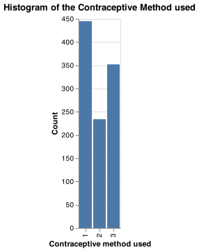
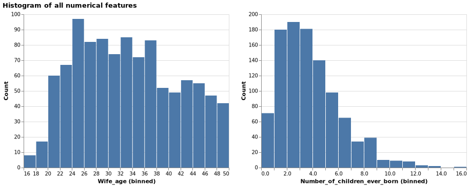
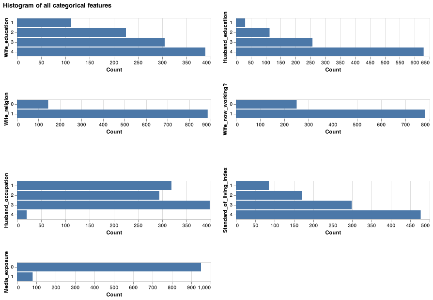
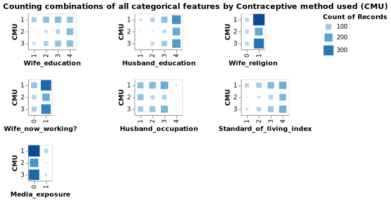

# EDA

## Summary of the train data
We performed the exploratory data analysis on the train data. There are no missing values in the dataset. Below is the attribute information.

| Column name                  | Description                                  | Type       | Values                              |
| ---------------------------- | ------------------------------------------- | ----------- |  ---------------------------------- |
| Wife age                     | Wife's age                                  | Numerical   | any positive values                 |
| Wife education               | Wife's education                            | Categorical | 1=low, 2, 3, 4=high                 |
| Husband education            | Husband's education                         | Categorical | 1=low, 2, 3, 4=high                 |
| Number of children ever born | Number of children ever born                | Numerical   | any positive values                 |
| Wife religion                | Wife's religion                             | Binary      | 0=Non-Islam, 1=Islam                |
| Wife now working?            | Is wife working or not                      | Binary      | 0=Yes, 1=No                         |
| Husband occupation           | Husband's occupation                        | Categorical | 1, 2, 3, 4                          |
| Standard-of-living index     | Standard-of-living Index                    | Categorical | 1=low, 2, 3, 4=high                 |
| Media Exposure               | Media exposure                              | Binary      | 0=Good, 1=Not good                  |
| Contraceptive method used    | Contraceptive method used (Class Attribute) | Categorical | 1=No-use, 2=Long-term, 3=Short-term |

```{python, include=TRUE}
import pandas as pd
train_df = pd.read_csv(
    "../data/processed/train.csv"
)
train_df.info()
```

## Distribution of target class
From the Figure \@ref(fig:histTarget) It can be seen that the target class is imbalanced, with 1 (No-use) being the most observations, followed by 3 (Short-term) and 2 (Long-term). But it is not necessary to immediately start our modelling plan with over- or under-samplinyg. We shall explore the data and create the model first.

```{r histTarget, echo=FALSE, fig.cap="Histogram of the Contraceptive Method used (target class)", out.width = '50%'}

```

## Histogram of all numerical features
After taking a look at the distributions of our numerical features from the figure \@ref(fig:histNum), and we found that their distribution are skewed to the right. This is expected as there are more young wife than old wife and most people have around two to three kids.

```{r histNum, echo=FALSE, fig.cap="Histogram of all numerical features", out.width = '100%'}

```

## Histogram of all non-numerical features
From the figure \@ref(fig:countCat), the survey captured the majority of the observation from women with high levels of education, religious belief, educated partners and living at a high standard of living. 
```{r countCat, echo=FALSE, fig.cap="Histogram of all non-numeric features", out.width = '100%'}

```

It is found that most of the observation by target class 1 (no contraception) lies on certain categorical variables from the figure \@ref(fig:countCatByTarget). But since there is class imbalance problem, we cannot imply that they are correlated.

```{r countCatByTarget, echo=FALSE, fig.cap="Counting Combinations of all categorical features by the target class", out.width = '100%'}

```