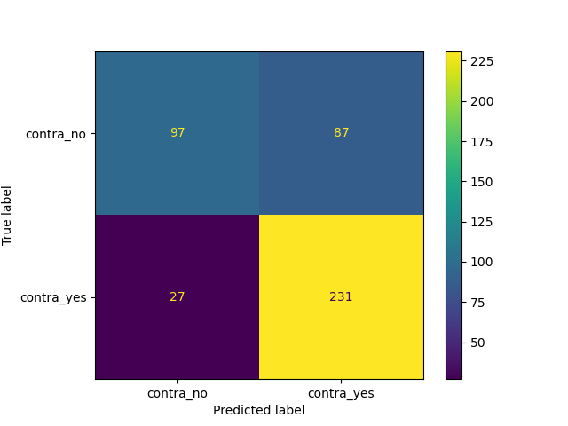
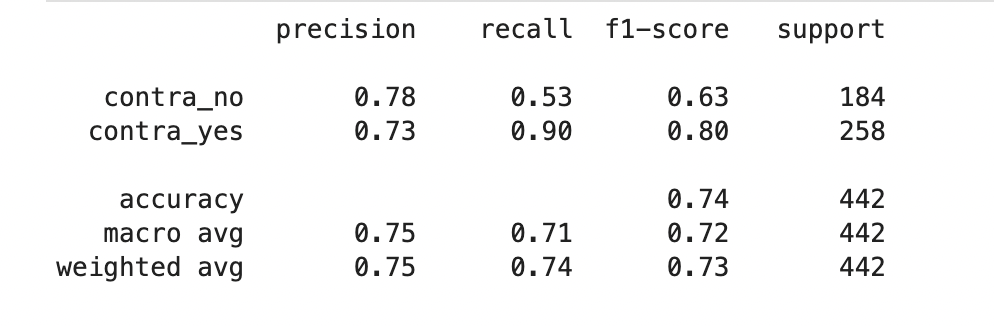
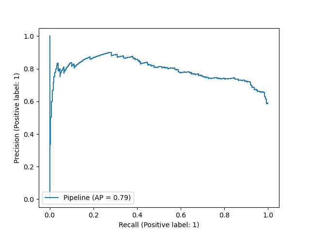
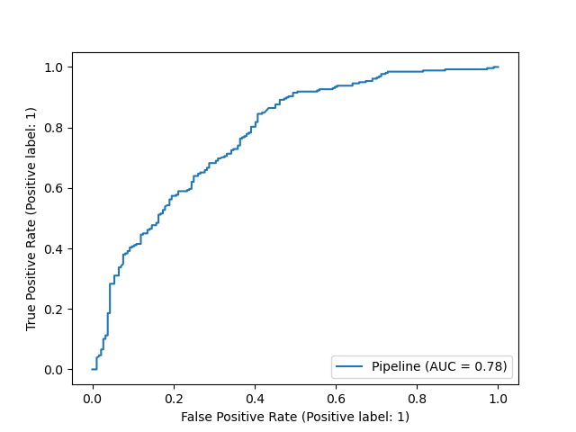

---
output:
  html_document: default
  pdf_document: default
---
# Model Testing
After finding out the best parameters by optimizing the accuracy score, we tried the model on the test data set.In Total there were 442 Observations in the test split. 

a) 0=No Use = 184
b) 1=Use = 258

## Confusion Matrix:

We will study the confusion matrix to understand the model's predictive power\@ref(fig:confusionmat):

```{r confusionmat, echo=FALSE, fig.cap="Confusion Matrix (Actual vs Predicted)", out.width = '50%'}



```

Look at the confusion matrix we can see that model is predicting well, the accuracy is 0.74. However, there are also some false -ve and false +ve error that is coming, so there are still some scope of improvement.

## Scoring Metric:

We also looked at the recall, precision and the f1-score \@ref(fig:scoringmet)::

```{r scoringmet, echo=FALSE, fig.cap="Scoring Metrics", out.width = '50%'}

```


## Precision-Recall Curve:

Figure \@ref(fig:precrec)

```{r precrec, echo=FALSE, fig.cap="Precision vs Recall Curve", out.width = '50%'}

```


## ROC Curve

Figure \@ref(fig:roccurve)
```{r roccurve, echo=FALSE, fig.cap="AUC ROC Curve", out.width = '100%'}

```

## Final Conclusion


We have tried 4 different models, the intent was to predict the use of contraceptive based on socio-economic and eduction level. As we can see from the above parameters, The model is performing well with an accuracy of $0.74$ and recall of $0.9$, precision of $0.73$ and f1_score of $0.8$ and AUC $78%$. This is in line with our training model.The very high recall shows that there are less number of false negatives.

Nevertheless, there are still cases where the model is not predicting correctly, and hence there is scope of improvement, before we deploy it in a real world scenario.

