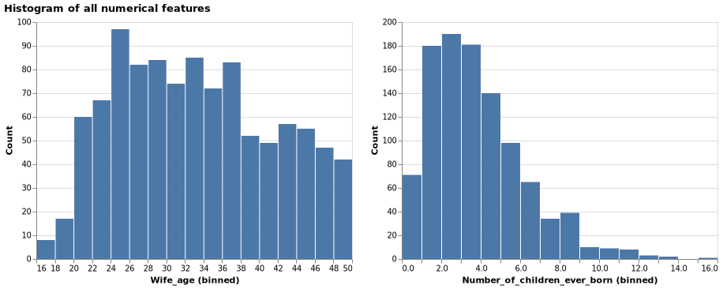
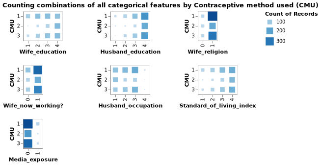
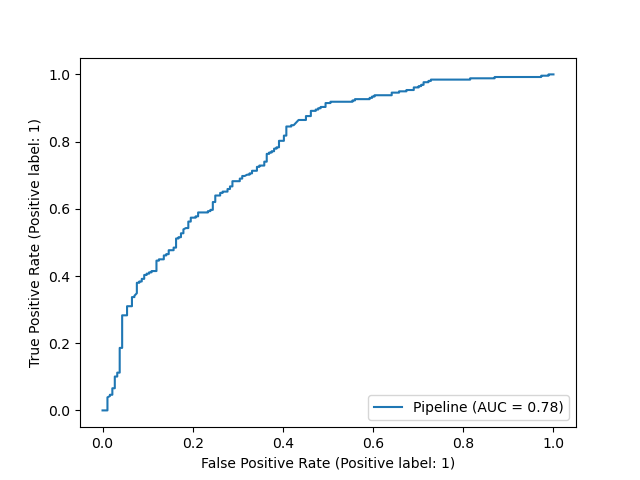

Contraceptive Method Predictor Report
================
Christopher Alexander, Yik Hong Chan, Abhiket Gaurav, Valli A
2021-11-26 (updated: 2021-11-29)

# Summary

Here we attempt to build a classification model using the SVC classifier
algorithm which can help predict the use of contraceptive of a woman
based on her demographic and socio-economic characteristics. The target
which was originally of 3 classes has been modified to 2 classes with
target `1` defining usage of contraceptive (including short term and
long term) and `0` defining no usage of contraceptive.

Our model performed fairly well on unseen data , with an overall
accuracy of \~ 74% and the area under the curve (AUC) is of 78%. However
the model still has a few false predictions for the non usage of
contraceptive. These cases where false positives, that is predicting the
usage of contraceptive when in fact the person does not use
contraceptives. These kind of predictions give wrong insights of
contraceptive usage, thus we feel further work to improve model
prediction is needed before we could put this model in the real world.

# Introduction

In this project we are trying to answer the question: given the the
demographic and socio-economic status: are we able to predict the
contraceptive method preferred by the individual? Answering this
question is important because of the adverse effects contraceptive’s can
have on a person’s health based on the usage. Furthermore, it also gives
us an understanding of the factors that could have contributed to the
reasons behind why the contraceptive market is such a big industry in
the health care sector right now. Here we approach this problem by using
machine learning algorithm to predict a contraceptive method preferred
by the individual given the women’s demographic and socio-economic
status.

# Data

This dataset is a subset of the 1987 National Indonesia Contraceptive
Prevalence Survey (Lim, Loh, and Shih 2000). It was sourced from the UCI
Machine Learning Repository (Dua and Graff 2017) and can be found
[here](https://archive.ics.uci.edu/ml/datasets/Contraceptive+Method+Choice).
The samples are married women who were either not pregnant or do not
know if they were at the time of interview. Each row in the data set
represents the sample taken from women, including their demographic
information and their socio-economic status.

# EDA

## Summary of the train data

We performed the exploratory data analysis on the train data. There are
no missing values in the train dataset. Below is the attribute
information.

| Column name                  | Description                                 | Type        | Values                              |
|------------------------------|---------------------------------------------|-------------|-------------------------------------|
| Wife age                     | Wife’s age                                  | Numerical   | any positive values                 |
| Wife education               | Wife’s education                            | Categorical | 1=low, 2, 3, 4=high                 |
| Husband education            | Husband’s education                         | Categorical | 1=low, 2, 3, 4=high                 |
| Number of children ever born | Number of children ever born                | Numerical   | any positive values                 |
| Wife religion                | Wife’s religion                             | Binary      | 0=Non-Islam, 1=Islam                |
| Wife now working?            | Is wife working or not                      | Binary      | 0=Yes, 1=No                         |
| Husband occupation           | Husband’s occupation                        | Categorical | 1, 2, 3, 4                          |
| Standard-of-living index     | Standard-of-living Index                    | Categorical | 1=low, 2, 3, 4=high                 |
| Media Exposure               | Media exposure                              | Binary      | 0=Good, 1=Not good                  |
| Contraceptive method used    | Contraceptive method used (Class Attribute) | Categorical | 1=No-use, 2=Long-term, 3=Short-term |

``` python
import pandas as pd
train_df = pd.read_csv(
    "../data/processed/train.csv"
)
train_df.info()
```

    ## <class 'pandas.core.frame.DataFrame'>
    ## RangeIndex: 1031 entries, 0 to 1030
    ## Data columns (total 10 columns):
    ##  #   Column                        Non-Null Count  Dtype
    ## ---  ------                        --------------  -----
    ##  0   Wife_age                      1031 non-null   int64
    ##  1   Wife_education                1031 non-null   int64
    ##  2   Husband_education             1031 non-null   int64
    ##  3   Number_of_children_ever_born  1031 non-null   int64
    ##  4   Wife_religion                 1031 non-null   int64
    ##  5   Wife_now_working?             1031 non-null   int64
    ##  6   Husband_occupation            1031 non-null   int64
    ##  7   Standard_of_living_index      1031 non-null   int64
    ##  8   Media_exposure                1031 non-null   int64
    ##  9   Contraceptive_method_used     1031 non-null   int64
    ## dtypes: int64(10)
    ## memory usage: 80.7 KB

## Distribution of target class

From the Figure @ref(fig:histTarget) It can be seen that the target
class is imbalanced, with 1 (No-use) being the most observations,
followed by 3 (Short-term) and 2 (Long-term). But it is not necessary to
immediately start our modelling plan with over- or under-samplinyg. We
shall explore the data and create the model first.


## Histogram of all numerical features

After taking a look at the distributions of our numerical features from
the figure @ref(fig:histNum), and we found that their distribution are
skewed to the right. This is expected as there are more young wife than
old wife and most people have around two to three kids.



## Histogram of all non-numerical features

From the figure @ref(fig:countCat), the survey captured the majority of
the observation from women with high levels of education, religious
belief, educated partners and living at a high standard of living.


## Relation betweeen target and non-numerical features

It is found that most of the observation by target class 1 (no
contraception) lies on certain categorical variables from the figure
@ref(fig:countCatByTarget). But since there is class imbalance problem,
we cannot imply that they are correlated.



# Pre-Processing & Model Selection

## Data Pre-Processing

From the EDA (Exploratory Data Analysis) and the variable description we
found that there were no missing value. However, the variables were of
different data types. The following table shows the different variables
and the transformations performed on each of them .

| Data Type | Variables                                     | Transformation | Technique        |
|-----------|-----------------------------------------------|----------------|------------------|
| Numerical | Wife’s age, Number of children ever born      | Scaling        | Standard Scaling |
| Ordinal   | Wife’s education, Husband Education,          | Encoding       | Ordinal Encoding |
|           | Husband’s Occupation,Standard of living Index |                |                  |
| Binary    | Wife’s religion, Wife working Media Exposure  | None           | Pass through     |

## Finding the best Model:

The target variable (Contraceptive method used) has three values:

1=No-use, 2=Long-term, 3=Short-term

For simplicity and better model performance. We have combined
2=Long-term, 3=Short-term into one class and it was given a value of 1.
And the label 1=No-use was given a value of 0.

Our target distribution now have 0=No-use : 445 observations, 1=use :
586 observations.Our problem turns into binary classification problem.
The algorithms we tried in the process of finding the best model are:

1.  Decision Tree
2.  kNN
3.  Logistic Regression
4.  RBF SVC

## Results of Cross Validation

From the Figure @ref(tab:crossVal) It can be clearly seen than the RBF
SVC is giving us the best score on both train and cross val dataset. The
evaluation metric used for the cross validation was accuracy.

| X           | decision.tree |       kNN | Logistic.Regression |   RBF.SVM |
|:------------|--------------:|----------:|--------------------:|----------:|
| fit_time    |     0.0075013 | 0.0060797 |           0.0127588 | 0.0252872 |
| score_time  |     0.0033298 | 0.0087663 |           0.0031190 | 0.0130505 |
| test_score  |     0.6313916 | 0.6460016 |           0.6595563 | 0.6944796 |
| train_score |     0.9856934 | 0.7737629 |           0.6808932 | 0.7485466 |

Cross Validation Result (Score for Accuracy)

## Hyper-Parameter Optimization

Since the performance of RBF SVC was the best we took it further for
hyper-parameter tuning. The results of the top 5 models are shown in
@ref(tab:hyperparam). We found that the best parameters are: C= 10.0
gamma = 0.01.

| X                         |         X1 |           X2 |           X3 |          X4 |         X5 |
|:--------------------------|-----------:|-------------:|-------------:|------------:|-----------:|
| mean_test_score           |  0.7012710 |    0.6973969 |    0.6964214 |   0.6954833 |  0.6935275 |
| param_svc\_\_gamma        |  0.0100000 |    0.0010000 |    0.0100000 |   0.0100000 |  0.1000000 |
| param_svc\_\_C            | 10.0000000 | 1000.0000000 | 1000.0000000 | 100.0000000 | 10.0000000 |
| param_svc\_\_class_weight |         NA |           NA |           NA |          NA |         NA |
| mean_fit_time             |  0.2298147 |    0.2732129 |    0.6221072 |   0.2664836 |  0.2516678 |

Hyperparameter Selection

# Model Testing

After finding out the best parameters by optimizing the accuracy score,
we tried the model on the test data set. In Total there were 442
Observations in the test split.

1.  0=No Use = 184
2.  1=Use = 258

## Confusion Matrix:

We will study the confusion matrix to understand the model’s predictive
power@ref(fig:confusionmat):


By looking at the confusion matrix we can see the model predicting well
on the total number of True positives i.e 231 and True Negatives i.e 97
. However they are some false +ve and -ve . False positives are given by
where we predict the usage of contraceptive’s when in fact the person
does not use contraceptives i.e in our matrix 87 .

## Scoring Metric:

We also looked at the recall, precision and the f1-score considering
each class to be the positive class. The recall of 0.90 says we have a
good true positive rate (TPR ) for the `1` class while the 0.53 shows
the TPR of the `0` class. The cumulative scores can be found in
`macro avg` and `weighted avg` @ref(fig:scoringmet)::


## Precision-Recall Curve:

To understand the precision and recall trade off our model we plotted
the PR curve with the mean Average Precision score. We observed a good
enough AP score of 0.79 Figure @ref(fig:precrec)


## ROC Curve

In order to get an overall score for our model . We observe the Area
under the curve which gives us a decent score of 78% Figure
@ref(fig:roccurve)



# Final Conclusion

We have tried 4 different models, the intent was to predict the use of
contraceptive based on socio-economic and education level. As we can see
from the above parameters, The model is performing well with an accuracy
of 74% , recall of 90%, precision of 73% , f1_score of 80% and AUC 78%.
This is in line with our validation scores.The very high recall shows
that there are less number of false negatives.

Nevertheless, there are still cases where the model is not predicting
correctly, and hence there is scope of improvement, before we deploy it
in a real world scenario.

# Acknowledgment

This dataset is a subset of the 1987 National Indonesia Contraceptive
Prevalence Survey (Lim, Loh, and Shih 2000). It was sourced from the UCI
Machine Learning Repository (Dua and Graff 2017).

The Python programming languages (Van Rossum and Drake Jr 1995) and the
following Python packages were used to perform the analysis: altair
(VanderPlas et al. 2018), docopt (de Jonge 2018), matplotlib (Hunter
2007), numpy (Harris et al. 2020), pandas (McKinney et al. 2010),
sckit-learn (Pedregosa et al. 2011). The code used to perform the
analysis and create this report can be found
[here](https://github.com/UBC-MDS/contraceptive_method_predictor).

# References

<div id="refs" class="references csl-bib-body hanging-indent">

<div id="ref-docopt" class="csl-entry">

de Jonge, Edwin. 2018. *Docopt: Command-Line Interface Specification
Language*. <https://CRAN.R-project.org/package=docopt>.

</div>

<div id="ref-Dua:2019" class="csl-entry">

Dua, Dheeru, and Casey Graff. 2017. “UCI Machine Learning Repository.”
University of California, Irvine, School of Information; Computer
Sciences. <http://archive.ics.uci.edu/ml>.

</div>

<div id="ref-2020NumPy-Array" class="csl-entry">

Harris, Charles R., K. Jarrod Millman, Stéfan J van der Walt, Ralf
Gommers, Pauli Virtanen, David Cournapeau, Eric Wieser, et al. 2020.
“Array Programming with NumPy.” *Nature* 585: 357–62.
<https://doi.org/10.1038/s41586-020-2649-2>.

</div>

<div id="ref-hunter2007matplotlib" class="csl-entry">

Hunter, John D. 2007. “Matplotlib: A 2d Graphics Environment.”
*Computing in Science & Engineering* 9 (3): 90–95.

</div>

<div id="ref-lls-cpacttt-00" class="csl-entry">

Lim, Tjen-Sien, Wei-Yin Loh, and Yu-Shan Shih. 2000. “A Comparison of
Prediction Accuracy, Complexity, and Training Time of Thirty-Three Old
and New Classification Algorithms.” *Machine Learning* 40 (3): 203–28.

</div>

<div id="ref-mckinney2010data" class="csl-entry">

McKinney, Wes et al. 2010. “Data Structures for Statistical Computing in
Python.” In *Proceedings of the 9th Python in Science Conference*,
445:51–56. Austin, TX.

</div>

<div id="ref-pedregosa2011scikit" class="csl-entry">

Pedregosa, Fabian, Gaël Varoquaux, Alexandre Gramfort, Vincent Michel,
Bertrand Thirion, Olivier Grisel, Mathieu Blondel, et al. 2011.
“Scikit-Learn: Machine Learning in Python.” *Journal of Machine Learning
Research* 12 (Oct): 2825–30.

</div>

<div id="ref-van1995python" class="csl-entry">

Van Rossum, Guido, and Fred L Drake Jr. 1995. *Python Tutorial*. Centrum
voor Wiskunde en Informatica Amsterdam, The Netherlands.

</div>

<div id="ref-vanderplas2018altair" class="csl-entry">

VanderPlas, Jacob, Brian Granger, Jeffrey Heer, Dominik Moritz, Kanit
Wongsuphasawat, Arvind Satyanarayan, Eitan Lees, Ilia Timofeev, Ben
Welsh, and Scott Sievert. 2018. “Altair: Interactive Statistical
Visualizations for Python.” *Journal of Open Source Software* 3 (32):
1057.

</div>

</div>
