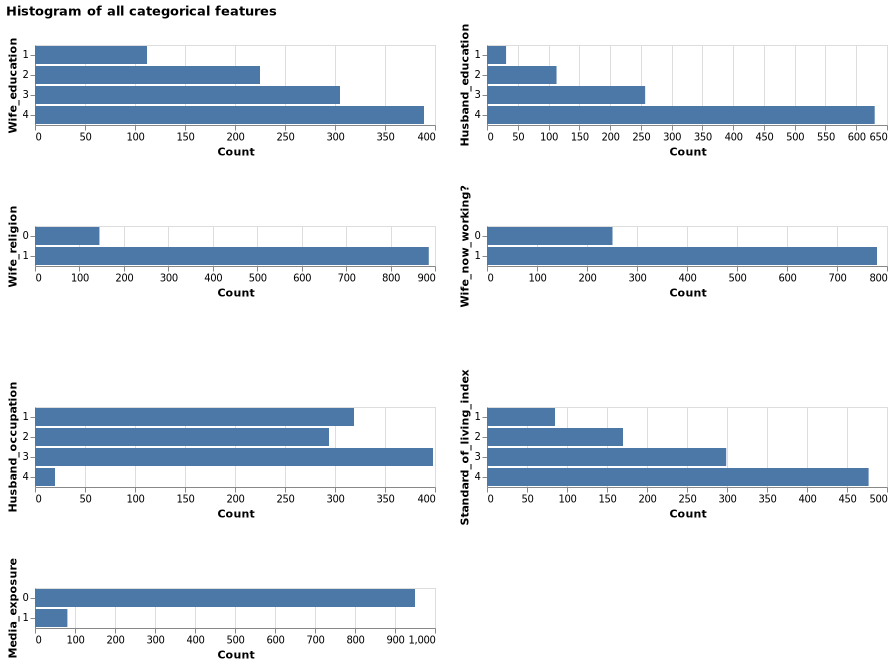

Contraceptive Method Predictor Report
================
Christopher Alexander, Yik Hong Chan, Abhiket Gaurav, Valli A
2021-11-26 (updated: 2021-12-04)

-   [1 Summary](#summary)
-   [2 Introduction](#introduction)
-   [3 Data](#data)
-   [4 Exploratory Data Analysis (EDA)](#exploratory-data-analysis-eda)
    -   [4.1 Summary of the training
        dataset](#summary-of-the-training-dataset)
    -   [4.2 Distribution of target
        class](#distribution-of-target-class)
    -   [4.3 Histogram of all numerical
        features](#histogram-of-all-numerical-features)
    -   [4.4 Histogram of all non-numerical
        features](#histogram-of-all-non-numerical-features)
    -   [4.5 Relation betweeen target and non-numerical
        features](#relation-betweeen-target-and-non-numerical-features)
-   [5 Pre-Processing & Model
    Selection](#pre-processing--model-selection)
    -   [5.1 Data Pre-Processing](#data-pre-processing)
-   [6 Finding the best Model:](#finding-the-best-model)
    -   [6.1 Results of Cross Validation](#results-of-cross-validation)
    -   [6.2 Hyper-Parameter
        Optimization](#hyper-parameter-optimization)
-   [7 Model Testing](#model-testing)
    -   [7.1 Confusion Matrix:](#confusion-matrix)
    -   [7.2 Scoring Metric:](#scoring-metric)
    -   [7.3 Precision-Recall Curve:](#precision-recall-curve)
    -   [7.4 ROC Curve](#roc-curve)
    -   [7.5 Final Conclusion](#final-conclusion)
-   [8 Acknowledgment](#acknowledgment)
-   [9 References](#references)

# 1 Summary

Here we attempt to build a predictive model using the SVC classifier
algorithm which can help predict the use of contraceptive of a woman
based on her demographic and socio-economic characteristics. The target
which was originally of 3 classes has been modified to 2 classes with
target `1` defining usage of contraceptive (including short term and
long term) and `0` defining no usage of contraceptive for simplicity and
practical reasons. So now the predictive model has become a binary
classification problem that we have explored in the project.

Our model performed fairly well on unseen data , with an overall
accuracy of \~ 74% and the area under the curve (AUC) is of 78%. However
the model still has a few false predictions for the non usage of
contraceptive. These cases where false positives, that is predicting the
usage of contraceptive when in fact the person does not use
contraceptives. These kind of predictions give wrong insights of
contraceptive usage, thus we feel further work to improve model
prediction is needed before we could put this model in the real world.

# 2 Introduction

In this project we are trying to answer the question: given the the
demographic and socio-economic status: are we able to predict the usage
of the contraceptive method (use vs no use)? Answering this question is
important because of the adverse effects contraceptive’s can have on a
person’s health based on the usage. Furthermore, it also gives us an
understanding of the factors that could have contributed to the reasons
behind why the contraceptive market is such a big industry in the health
care sector right now. Here we approach this problem by using machine
learning algorithm to predict a contraceptive method preferred by the
individual given the women’s demographic and socio-economic status.

# 3 Data

This dataset is a subset of the 1987 National Indonesia Contraceptive
Prevalence Survey (Lim, Loh, and Shih 2000). It was sourced from the UCI
Machine Learning Repository (Dua and Graff 2017) and can be found
[here](https://archive.ics.uci.edu/ml/datasets/Contraceptive+Method+Choice).
The samples are married women who were either not pregnant or do not
know if they were at the time of interview. Each row in the data set
represents the sample taken from women, including their demographic
information and their socio-economic status.

# 4 Exploratory Data Analysis (EDA)

## 4.1 Summary of the training dataset

First, it is important to identify and understand the attributes of the
dataset. Exploratory data analysis was performed on the training dataset
and was found to have no missing values. The attributes of the training
dataset are outlined below

| Column name                  | Description                                 | Type        | Values                              |
|------------------------------|---------------------------------------------|-------------|-------------------------------------|
| Wife age                     | Wife’s age                                  | Numerical   | any positive values                 |
| Wife education               | Wife’s education                            | Categorical | 1=low, 2, 3, 4=high                 |
| Husband education            | Husband’s education                         | Categorical | 1=low, 2, 3, 4=high                 |
| Number of children ever born | Number of children ever born                | Numerical   | any positive values                 |
| Wife religion                | Wife’s religion                             | Binary      | 0=Non-Islam, 1=Islam                |
| Wife now working?            | Is wife working or not                      | Binary      | 0=Yes, 1=No                         |
| Husband occupation           | Husband’s occupation                        | Categorical | 1, 2, 3, 4                          |
| Standard-of-living index     | Standard-of-living Index                    | Categorical | 1=low, 2, 3, 4=high                 |
| Media Exposure               | Media exposure                              | Binary      | 0=Good, 1=Not good                  |
| Contraceptive method used    | Contraceptive method used (Class Attribute) | Categorical | 1=No-use, 2=Long-term, 3=Short-term |

``` python
import pandas as pd
train_df = pd.read_csv(
    "../data/processed/train.csv"
)
train_df.info()
```

    ## <class 'pandas.core.frame.DataFrame'>
    ## RangeIndex: 1031 entries, 0 to 1030
    ## Data columns (total 10 columns):
    ##  #   Column                        Non-Null Count  Dtype
    ## ---  ------                        --------------  -----
    ##  0   Wife_age                      1031 non-null   int64
    ##  1   Wife_education                1031 non-null   int64
    ##  2   Husband_education             1031 non-null   int64
    ##  3   Number_of_children_ever_born  1031 non-null   int64
    ##  4   Wife_religion                 1031 non-null   int64
    ##  5   Wife_now_working?             1031 non-null   int64
    ##  6   Husband_occupation            1031 non-null   int64
    ##  7   Standard_of_living_index      1031 non-null   int64
    ##  8   Media_exposure                1031 non-null   int64
    ##  9   Contraceptive_method_used     1031 non-null   int64
    ## dtypes: int64(10)
    ## memory usage: 80.7 KB

## 4.2 Distribution of target class

From the histogram @ref(fig:histTarget) it can be observed that there
are three classes - with 1 (“No-use”), 2 (“Long-term use”), followed by
3 (“Short-term use”). We have combined 2 and 3 as “use” case and have
left 1 as it is (“no-use” case). With this modification we are trying to
predict the “use vs no use” of contraceptives.


## 4.3 Histogram of all numerical features

From the distributions in the histogram @ref(fig:histNum), it can be
observed that the data is skewed to the right. This can be attributed to
significantly higher numbers of wives who are between 28 to 38 years old
than those with ages higher than 38 years, and that most of the wives
have two to three kids on average.


## 4.4 Histogram of all non-numerical features

From the histogram @ref(fig:countCat), it can be observed that a
majority of the responses / observations in the survey are from women
having high levels of education, religious beliefs, with educated
partners and with a high standard of living.



## 4.5 Relation betweeen target and non-numerical features

From the figure @ref(fig:countCatByTarget), it can be observed that most
of the observations of target class 1 (no contraception) rest on certain
categorical values. However, as we had earlier pointed out the imbalance
in the distribution of class values, we cannot imply correlation.


# 5 Pre-Processing & Model Selection

## 5.1 Data Pre-Processing

Based on the EDA (Exploratory Data Analysis) performed earlier and
variable descriptions, it can be inferred that there are no missing
values. However, the variables were of different data types. In order to
perform operations on data, we need to ensure consistency of data types.
The following table shows different variables in the dataset and the
respective transformation performed on each of them.

| Data Type | Variable                                      | Transformation performed | Technique used   |
|-----------|-----------------------------------------------|--------------------------|------------------|
| Numerical | Wife’s age, Number of children ever born      | Scaling                  | Standard Scaling |
| Ordinal   | Wife’s education, Husband Education,          | Encoding                 | Ordinal Encoding |
|           | Husband’s Occupation,Standard of living Index |                          |                  |
| Binary    | Wife’s religion, Wife working Media Exposure  | None                     | Pass through     |

For simplicity and better model performance. We have combined
`2 = Long-term`, `3 = Short-term` into one class and it was given a
value of `1`. And the label `1 = No-use` was given a value of `0`,
because our aim is to predict the use(long or short)/ no use of
contraceptives .

Our target distribution now have \* `0 = No-use` : **445** observations,
\* `1 = use` : **586** observations.

# 6 Finding the best Model:

With this data, our problem statement now turns into binary
classification problem. We have tried the following predictive models:

1.  Decision Tree
2.  kNN
3.  Logistic Regression
4.  RBF SVC

## 6.1 Results of Cross Validation

From the table @ref(tab:crossVal), it can be clearly inferred that the
RBF SVC algorithm is giving us the best score on both training and cross
val dataset. The metric used to evaluate the cross validation was
**accuracy**.

| X           | decision.tree |       kNN | Logistic.Regression |   RBF.SVM |
|:------------|--------------:|----------:|--------------------:|----------:|
| fit_time    |     0.0071795 | 0.0061422 |           0.0115628 | 0.0275451 |
| score_time  |     0.0031524 | 0.0087552 |           0.0028854 | 0.0136168 |
| test_score  |     0.6313916 | 0.6460016 |           0.6595563 | 0.6944796 |
| train_score |     0.9856934 | 0.7737629 |           0.6808932 | 0.7485466 |

Cross Validation Result (Score for Accuracy)

## 6.2 Hyper-Parameter Optimization

Given the performance of RBF SVC was the best, it was chosen for
hyper-parameter tuning. The results of the top 5 models are shown in
@ref(tab:hyperparam).

It can be observed that the best parameters are: `C = 10.0`,
`gamma = 0.01`.

| X                         |         X1 |           X2 |           X3 |          X4 |         X5 |
|:--------------------------|-----------:|-------------:|-------------:|------------:|-----------:|
| mean_test_score           |  0.7012710 |    0.6973969 |    0.6964214 |   0.6954833 |  0.6935275 |
| param_svc\_\_gamma        |  0.0100000 |    0.0010000 |    0.0100000 |   0.0100000 |  0.1000000 |
| param_svc\_\_C            | 10.0000000 | 1000.0000000 | 1000.0000000 | 100.0000000 | 10.0000000 |
| param_svc\_\_class_weight |         NA |           NA |           NA |          NA |         NA |
| mean_fit_time             |  0.2280286 |    0.2724010 |    0.6007762 |   0.2595954 |  0.2459544 |

Hyperparameter Selection

# 7 Model Testing

After finding out the best parameters by optimizing the accuracy score,
we tried the model on the test data set.In Total there were 442
Observations in the test split.

1.  0=No Use = 184
2.  1=Use = 258

## 7.1 Confusion Matrix:

A study of the confusion matrix will provide an understanding into the
model’s predictive power from the figure @ref(fig:confusionmat):


## 7.2 Scoring Metric:

The recall, precision and the f1-score were observed while considering
each class to be the positive class. The recall value of **0.90**
indicates a good true positive rate (TPR) for the `1` class while the
**0.53** indicates the TPR of the `0` class. These cumulative scores can
be found in `macro avg` and `weighted avg` in the table
@ref(tab:scoringmet).

| X            | precision |    recall |  f1.score | support |
|:-------------|----------:|----------:|----------:|--------:|
| contra_no    | 0.7822581 | 0.5271739 | 0.6298701 |     184 |
| contra_yes   | 0.7264151 | 0.8953488 | 0.8020833 |     258 |
| accuracy     |        NA |        NA | 0.7420814 |      NA |
| macro avg    | 0.7543366 | 0.7112614 | 0.7159767 |     442 |
| weighted avg | 0.7496619 | 0.7420814 | 0.7303928 |     442 |

Scoring Metrics

## 7.3 Precision-Recall Curve:

The precision and recall trade-off of our model could be observed by
plotting the PR curve with the mean Average Precision score. A good
enough AP score of 0.79 could be observed from the figure
@ref(fig:precrec).


## 7.4 ROC Curve

In order to obtain an overall score for our model, the Area under the
curve was observed which resulted in a decent score of 78% from the
figure @ref(fig:roccurve).


<<<<<<< HEAD


# Final Conclusion
=======
## 7.5 Final Conclusion
>>>>>>> bb85d9b7ecf1e6b6317eb6df1e99e43a239376f7

The intent of the process was to predict the use of contraceptives in
women based on socio-economic and education levels. In the process, 4
different models were tried. It can be observed from the above
parameters that the chosen model is indeed performing well with an
accuracy of 74% , `recall` of 90%, `precision` of 73% , `f1_score` of
80% and `AUC` 78%. These results are in line with the validation scores
outlined previously. The high `recall value` of 90% indicates that
`False Negatives` are very low.

However, it could be also be observed that there are indeed cases where
the model is not predicting correctly, and hence there is scope for
improvement before the model is deployed in a real world scenario.

# 8 Acknowledgment

This dataset is a subset of the 1987 National Indonesia Contraceptive
Prevalence Survey (Lim, Loh, and Shih 2000). It was sourced from the UCI
Machine Learning Repository (Dua and Graff 2017).

The Python programming languages (Van Rossum and Drake Jr 1995) and the
following Python packages were used to perform the analysis: altair
(VanderPlas et al. 2018), docopt (de Jonge 2018), matplotlib (Hunter
2007), numpy (Harris et al. 2020), pandas (McKinney et al. 2010),
sckit-learn (Pedregosa et al. 2011). The code used to perform the
analysis and create this report can be found
[here](https://github.com/UBC-MDS/contraceptive_method_predictor/tree/main/src).

# 9 References

<div id="refs" class="references csl-bib-body hanging-indent">

<div id="ref-docopt" class="csl-entry">

de Jonge, Edwin. 2018. *Docopt: Command-Line Interface Specification
Language*. <https://CRAN.R-project.org/package=docopt>.

</div>

<div id="ref-Dua:2019" class="csl-entry">

Dua, Dheeru, and Casey Graff. 2017. “UCI Machine Learning Repository.”
University of California, Irvine, School of Information; Computer
Sciences. <http://archive.ics.uci.edu/ml>.

</div>

<div id="ref-2020NumPy-Array" class="csl-entry">

Harris, Charles R., K. Jarrod Millman, Stéfan J van der Walt, Ralf
Gommers, Pauli Virtanen, David Cournapeau, Eric Wieser, et al. 2020.
“Array Programming with NumPy.” *Nature* 585: 357–62.
<https://doi.org/10.1038/s41586-020-2649-2>.

</div>

<div id="ref-hunter2007matplotlib" class="csl-entry">

Hunter, John D. 2007. “Matplotlib: A 2d Graphics Environment.”
*Computing in Science & Engineering* 9 (3): 90–95.

</div>

<div id="ref-lls-cpacttt-00" class="csl-entry">

Lim, Tjen-Sien, Wei-Yin Loh, and Yu-Shan Shih. 2000. “A Comparison of
Prediction Accuracy, Complexity, and Training Time of Thirty-Three Old
and New Classification Algorithms.” *Machine Learning* 40 (3): 203–28.

</div>

<div id="ref-mckinney2010data" class="csl-entry">

McKinney, Wes et al. 2010. “Data Structures for Statistical Computing in
Python.” In *Proceedings of the 9th Python in Science Conference*,
445:51–56. Austin, TX.

</div>

<div id="ref-pedregosa2011scikit" class="csl-entry">

Pedregosa, Fabian, Gaël Varoquaux, Alexandre Gramfort, Vincent Michel,
Bertrand Thirion, Olivier Grisel, Mathieu Blondel, et al. 2011.
“Scikit-Learn: Machine Learning in Python.” *Journal of Machine Learning
Research* 12 (Oct): 2825–30.

</div>

<div id="ref-van1995python" class="csl-entry">

Van Rossum, Guido, and Fred L Drake Jr. 1995. *Python Tutorial*. Centrum
voor Wiskunde en Informatica Amsterdam, The Netherlands.

</div>

<div id="ref-vanderplas2018altair" class="csl-entry">

VanderPlas, Jacob, Brian Granger, Jeffrey Heer, Dominik Moritz, Kanit
Wongsuphasawat, Arvind Satyanarayan, Eitan Lees, Ilia Timofeev, Ben
Welsh, and Scott Sievert. 2018. “Altair: Interactive Statistical
Visualizations for Python.” *Journal of Open Source Software* 3 (32):
1057.

</div>

</div>
