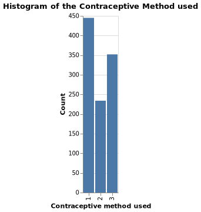

Contraceptive Method Predictor Report
================
Christopher Alexander, Yik Hong Chan, Abhiket Gaurav, Valli A
updated: 2021-12-11

# Summary

Here we attempt to build a classification model using the SVC classifier
algorithm which can help predict the use/or no use contraceptives by
women based on their demographic and socio-economic characteristics. The
target which was originally of 3 classes has been modified to 2 classes
with target `1` defining usage of contraceptive (including short term
and long term) and `0` defining no usage of contraceptive for simplicity
and practical reasons.

The overall accuracy of the model is \~ 74% and the area under the curve
(AUC) is of 78%.Given that the data-set was limited this seems to be a
decent score. However the model still has a few false predictions for
the non usage of contraceptive. These cases where false positives, that
is predicting the usage of contraceptive when in fact the person does
not use contraceptives. These kind of predictions give wrong insights of
contraceptive usage, thus we feel further work to improve model
prediction is needed before we could put this model in the real world.

Demographic Details of the location in use:

The data used in our project is a subset of 1987 National Indonesia
Contraceptive Prevalence Survey. The samples are married women who were
either not pregnant or do not know if they were at the time of
interview.

Inclusion of Wife’s religion Feature:

We have not dropped the wife’s religion feature while building our model
to predict owing to the following reasons:

1.  The country of data collection is Indonesia, which has 90% of the
    population following one particular religion. Because our project
    includes analysis of a population based on socio-economic and
    demographic parameters, not including religion in this data-set
    would render it incomplete and could also lead to skewed analysis of
    data. Therefore we believe , purely in the interest of objectivity
    that not including religion as a feature based on some non objective
    reason would be unscientifically unethical and irresponsible.

2.  Also, our data has only 9 features and dropping one of them would
    not help us get proper results.

3.  The difference in the training and the test scores is not much,
    hence we can say that our model is not over-fitting and hence,
    mathematically also, we see no need to drop the feature

Disclaimer\*

Inclusion of the wife’s religion feature is intended purely for
objective scientific analysis.

# Introduction

In this project we are trying to answer the question: given the
demographic and socio-economic status of a married woman can we predict
the use of contraceptive or not ? Answering this question is important
because of the adverse side effects contraceptives can have on a woman’s
health. Furthermore, it also gives us an understanding of the factors
that could have contributed to the reasons behind why the contraceptive
market is such a big industry in the health care sector right now. Here
we approach this problem by using machine learning algorithm to predict
whether a married woman prefers to use contraceptive or not given her
demographic and socio-economic status.

Disclaimer:

The study is limited to the data collected back in 1987, in Indonesia.
The whole analysis and model is based on this data-set and in no way,
should be used in general sense. This study is just for academic
purposes and should be used with caution when applying to “married-women
in general” and to “different geographies”. The data is dated, and the
global scenarios has changed a lot since then.Hence, no conclusive
remarks should be made.

# Data

This data-set is a subset of the 1987 National Indonesia Contraceptive
Prevalence Survey (Lim, Loh, and Shih 2000). It was sourced from the UCI
Machine Learning Repository (Dua and Graff 2017) and can be found
[here](https://archive.ics.uci.edu/ml/datasets/Contraceptive+Method+Choice).
The samples are of married women who were either not pregnant or do not
know if they were at the time of interview. Each row in the data set
represents the sample taken from women, including their demographic
information and their socio-economic status.

# Exploratory Data Analysis (EDA)

## Summary of the training dataset

First, it is important to identify and understand the attributes of the
data-set. Exploratory data analysis was performed on the training
data-set and was found to have no missing values. The attributes of the
training data-set are outlined below

| Column name                  | Description                                 | Type        | Values                              |
|------------------------------|---------------------------------------------|-------------|-------------------------------------|
| Wife age                     | Wife’s age                                  | Numerical   | any positive values                 |
| Wife education               | Wife’s education                            | Categorical | 1=low, 2, 3, 4=high                 |
| Husband education            | Husband’s education                         | Categorical | 1=low, 2, 3, 4=high                 |
| Number of children ever born | Number of children ever born                | Numerical   | any positive values                 |
| Wife religion                | Wife’s religion                             | Binary      | 0=Non-Islam, 1=Islam                |
| Wife now working?            | Is wife working or not                      | Binary      | 0=Yes, 1=No                         |
| Husband occupation           | Husband’s occupation                        | Categorical | 1, 2, 3, 4                          |
| Standard-of-living index     | Standard-of-living Index                    | Categorical | 1=low, 2, 3, 4=high                 |
| Media Exposure               | Media exposure                              | Binary      | 0=Good, 1=Not good                  |
| Contraceptive method used    | Contraceptive method used (Class Attribute) | Categorical | 1=No-use, 2=Long-term, 3=Short-term |

``` python
import pandas as pd
train_df = pd.read_csv(
    "../data/processed/train.csv"
)
train_df.info()
```

    ## <class 'pandas.core.frame.DataFrame'>
    ## RangeIndex: 1031 entries, 0 to 1030
    ## Data columns (total 10 columns):
    ##  #   Column                        Non-Null Count  Dtype
    ## ---  ------                        --------------  -----
    ##  0   Wife_age                      1031 non-null   int64
    ##  1   Wife_education                1031 non-null   int64
    ##  2   Husband_education             1031 non-null   int64
    ##  3   Number_of_children_ever_born  1031 non-null   int64
    ##  4   Wife_religion                 1031 non-null   int64
    ##  5   Wife_now_working?             1031 non-null   int64
    ##  6   Husband_occupation            1031 non-null   int64
    ##  7   Standard_of_living_index      1031 non-null   int64
    ##  8   Media_exposure                1031 non-null   int64
    ##  9   Contraceptive_method_used     1031 non-null   int64
    ## dtypes: int64(10)
    ## memory usage: 80.7 KB

## Distribution of target class

From the histogram @ref(fig:histTarget) it can be observed that there
are three classes - with 1 (“No-use”), 2 (“Long-term use”), followed by
3 (“Short-term use”). We have combined 2 and 3 as “use” case and have
left 1 as it is (“no-use” case). With this modification we are trying to
predict the “use vs no use” of contraceptives.



## Histogram of all numerical features

From the distributions in the histogram @ref(fig:histNum), it can be
observed that the data is skewed to the right. This can be attributed to
significantly higher numbers of married woman who are between 28 to 38
years old than those with ages higher than 38 years, and that most of
the woman have two to three kids on average.


## Histogram of all non-numerical features

From the histogram @ref(fig:countCat), it can be observed that a
majority of the responses / observations in the survey are from women
having high levels of education, religious beliefs, with educated
partners and with a high standard of living.


## Relation betweeen target and non-numerical features

From the figure @ref(fig:countCatByTarget), it can be observed that most
of the observations of target class 1 (no contraception) rest on certain
categorical values. However, as we had earlier pointed out the imbalance
in the distribution of class values, we cannot imply correlation.


# Pre-Processing & Model Selection

## Data Pre-Processing

Based on the EDA (Exploratory Data Analysis) performed earlier and
variable descriptions, it can be inferred that there are no missing
values. However, the variables were of different data types. In order to
perform operations on data, we need to ensure consistency of data types.
The following table shows different variables in the data-set and the
respective transformation performed on each of them.

| Data Type | Variable                                      | Transformation performed | Technique used   |
|-----------|-----------------------------------------------|--------------------------|------------------|
| Numerical | Wife’s age, Number of children ever born      | Scaling                  | Standard Scaling |
| Ordinal   | Wife’s education, Husband Education,          | Encoding                 | Ordinal Encoding |
| Ordinal   | Husband’s Occupation,Standard of living Index | Encoding                 | Ordinal Encoding |
| Binary    | Wife’s religion, Wife working Media Exposure  | None                     | Pass through     |

For simplicity and better model performance. We have combined
`2 = Long-term`, `3 = Short-term` into one class and it was given a
value of `1`. The label `1 = No-use` was given a value of `0`, because
our aim is to predict the use(long or short)/ no use of contraceptives .

Our target distribution now have \* `0 = No-use` : **445** observations,
\* `1 = use` : **586** observations.

# Finding the best Model:

With this data, our problem statement now turns into binary
classification problem. We have tried the following predictive models:

1.  Decision Tree
2.  kNN
3.  Logistic Regression
4.  RBF SVC

## Results of Cross Validation

From the table @ref(tab:crossVal), it can be clearly inferred that the
RBF SVC algorithm is giving us the best score on both training and cross
val data-set. The metric used to evaluate the cross validation was
**accuracy**.

| X           | decision.tree |       kNN | Logistic.Regression |   RBF.SVM |
|:------------|--------------:|----------:|--------------------:|----------:|
| fit_time    |     0.0119304 | 0.0125099 |           0.0259015 | 0.0421597 |
| score_time  |     0.0069579 | 0.0134420 |           0.0076053 | 0.0162925 |
| test_score  |     0.6313916 | 0.6527930 |           0.6595563 | 0.6944796 |
| train_score |     0.9856934 | 0.7725510 |           0.6808932 | 0.7485466 |

Cross Validation Result (Score for Accuracy)

## Hyper-Parameter Optimization

Given the performance of RBF SVC was the best, it was chosen for
hyper-parameter tuning. The results of the top 5 models are shown in
@ref(tab:hyperparam).

It can be observed that the best parameters are: `C = 10.0`,
`gamma = 0.01`.

| X                         |         X1 |           X2 |           X3 |          X4 |         X5 |
|:--------------------------|-----------:|-------------:|-------------:|------------:|-----------:|
| mean_test_score           |  0.7012710 |    0.6973969 |    0.6964214 |   0.6954833 |  0.6935275 |
| param_svc\_\_gamma        |  0.0100000 |    0.0010000 |    0.0100000 |   0.0100000 |  0.1000000 |
| param_svc\_\_C            | 10.0000000 | 1000.0000000 | 1000.0000000 | 100.0000000 | 10.0000000 |
| param_svc\_\_class_weight |         NA |           NA |           NA |          NA |         NA |
| mean_fit_time             |  0.2058732 |    0.1529772 |    0.4046357 |   0.1714467 |  0.1902466 |

Hyperparameter Selection

# Model Testing

After finding out the best parameters by optimizing the accuracy score,
we tried the model on the test data set.

## Confusion Matrix:

A study of the confusion matrix will provide an understanding into the
model’s predictive power from the figure @ref(fig:confusionmat):


We have considered the use of contraceptive method as positive class.By
looking at the confusion matrix, it can be observed that the model is
predicting well on the total number of `True positives` i.e 231 which
are the ones that the model predicted correctly to be using
contraceptive method.and `True Negatives` i.e 97 which denotes correctly
for not using contraceptive method. However, there are some false +ve
and -ve observed as well.

`False positives` are indicated when we affirmatively predict the usage
of contraceptives when in fact, the person does not use contraceptives
i.e in our matrix 87 .and `False Negatives` indicated when we
incorrectly predict the person is not using, when they are actually
using contraceptives.

## Scoring Metric:

The recall, precision and the f1-score were observed while considering
each class to be the positive class. The recall value of **0.90**
indicates a good true positive rate (TPR) for the `1` class while the
**0.53** indicates the TPR of the `0` class. These cumulative scores can
be found in `macro avg` and `weighted avg` in the table
@ref(tab:scoringmet).

| X            | precision |    recall |  f1.score | support |
|:-------------|----------:|----------:|----------:|--------:|
| contra_no    | 0.7822581 | 0.5271739 | 0.6298701 |     184 |
| contra_yes   | 0.7264151 | 0.8953488 | 0.8020833 |     258 |
| accuracy     |        NA |        NA | 0.7420814 |      NA |
| macro avg    | 0.7543366 | 0.7112614 | 0.7159767 |     442 |
| weighted avg | 0.7496619 | 0.7420814 | 0.7303928 |     442 |

Scoring Metrics

## Precision-Recall Curve:

The precision and recall trade-off of our model could be observed by
plotting the PR curve with the mean Average Precision score. A good
enough AP score of 0.79 could be observed from the figure
@ref(fig:precrec).


## ROC Curve

As mentioned above, the curves were plotted at a threshold of 0.5. In
order to obtain an overall score for our model, the Area under the curve
was observed which resulted in a decent score of 78% from the figure
@ref(fig:roccurve).


## Feature Importance

We have predicted the co-efficients/ weights of each features and found
that the features Number_of_children_ever_born, wife_age, wife_education
are considered to be top three features of importance.


The other features like standard_of_living_index, Husband_occupation,
wife_religion, Husband_education also seem to pay a significant role.
Media_exposure, surprisingly seem to not play any importance, but it may
be due to bias in the methods involved in data collection.Also as we can
saw in the EDA part, features like standard of living, Husband’s
education were coming as prominent ones.

# Final Conclusion

The intent of the process was to predict the use of contraceptives in
married woman based on socio-economic and education levels. In the
process, 4 different models were tried. It can be observed from the
above parameters that the chosen model is indeed performing well(given
the size of the data-set) with an accuracy of 74% , `recall` of 90%,
`precision` of 73% , `f1_score` of 80% and `AUC` 78%. The precision
indicates, that out of all predicted positives,how many are actually
positive, ie. out of 100 predicted positive samples, 73 were actually
using the contraceptives. Recall indicates, out of total positives how
many are predicted positive A high recall shows that our model could
identify most of them correctly. These results are in line with the
validation scores outlined previously. The high `recall value` of 90%
also indicates that `False Negatives` are very low and an appreciable
f1_score of 0.8.

However, it could be also be observed that there are indeed cases where
the model is not predicting correctly, and hence there is scope for
improvement before the model is deployed in a real world scenario.

# Acknowledgment

This data-set is a subset of the 1987 National Indonesia Contraceptive
Prevalence Survey (Lim, Loh, and Shih 2000). It was sourced from the UCI
Machine Learning Repository (Dua and Graff 2017).

The Python programming languages (Van Rossum and Drake Jr 1995) and the
following Python packages were used to perform the analysis: altair
(VanderPlas et al. 2018), docopt (de Jonge 2018), matplotlib (Hunter
2007), numpy (Harris et al. 2020), pandas (McKinney et al. 2010),
sckit-learn (Pedregosa et al. 2011). The code used to perform the
analysis and create this report can be found
[here](https://github.com/UBC-MDS/contraceptive_method_predictor/tree/main/src).

# References

<div id="refs" class="references csl-bib-body hanging-indent">

<div id="ref-docopt" class="csl-entry">

de Jonge, Edwin. 2018. *Docopt: Command-Line Interface Specification
Language*. <https://CRAN.R-project.org/package=docopt>.

</div>

<div id="ref-Dua:2019" class="csl-entry">

Dua, Dheeru, and Casey Graff. 2017. “UCI Machine Learning Repository.”
University of California, Irvine, School of Information; Computer
Sciences. <http://archive.ics.uci.edu/ml>.

</div>

<div id="ref-2020NumPy-Array" class="csl-entry">

Harris, Charles R., K. Jarrod Millman, Stéfan J van der Walt, Ralf
Gommers, Pauli Virtanen, David Cournapeau, Eric Wieser, et al. 2020.
“Array Programming with NumPy.” *Nature* 585: 357–62.
<https://doi.org/10.1038/s41586-020-2649-2>.

</div>

<div id="ref-hunter2007matplotlib" class="csl-entry">

Hunter, John D. 2007. “Matplotlib: A 2d Graphics Environment.”
*Computing in Science & Engineering* 9 (3): 90–95.

</div>

<div id="ref-lls-cpacttt-00" class="csl-entry">

Lim, Tjen-Sien, Wei-Yin Loh, and Yu-Shan Shih. 2000. “A Comparison of
Prediction Accuracy, Complexity, and Training Time of Thirty-Three Old
and New Classification Algorithms.” *Machine Learning* 40 (3): 203–28.

</div>

<div id="ref-mckinney2010data" class="csl-entry">

McKinney, Wes et al. 2010. “Data Structures for Statistical Computing in
Python.” In *Proceedings of the 9th Python in Science Conference*,
445:51–56. Austin, TX.

</div>

<div id="ref-pedregosa2011scikit" class="csl-entry">

Pedregosa, Fabian, Gaël Varoquaux, Alexandre Gramfort, Vincent Michel,
Bertrand Thirion, Olivier Grisel, Mathieu Blondel, et al. 2011.
“Scikit-Learn: Machine Learning in Python.” *Journal of Machine Learning
Research* 12 (Oct): 2825–30.

</div>

<div id="ref-van1995python" class="csl-entry">

Van Rossum, Guido, and Fred L Drake Jr. 1995. *Python Tutorial*. Centrum
voor Wiskunde en Informatica Amsterdam, The Netherlands.

</div>

<div id="ref-vanderplas2018altair" class="csl-entry">

VanderPlas, Jacob, Brian Granger, Jeffrey Heer, Dominik Moritz, Kanit
Wongsuphasawat, Arvind Satyanarayan, Eitan Lees, Ilia Timofeev, Ben
Welsh, and Scott Sievert. 2018. “Altair: Interactive Statistical
Visualizations for Python.” *Journal of Open Source Software* 3 (32):
1057.

</div>

</div>
