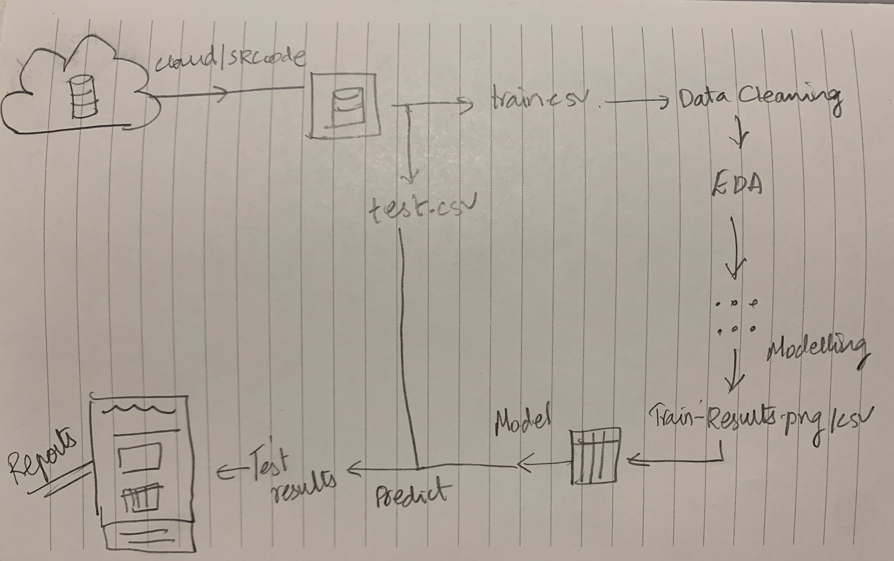

# Contraceptive Method Predictor

-   Author: Christopher Alexander
-   Contributors: Yik Hong Chan, Abhiket Gaurav, Valli A

A data analysis project to predict the contraceptive method choice of a woman based on her demographic and socio-economic characteristics.

## Summary

In this project we are trying to answer the question: given the the demographic and socio-economic status are we able to predict the contraceptive method preferred by the individual? Answering this question is important because of the adverse effects contraceptive's can have on a person's health based on the usage. Furthermore, it also gives us an understanding of the factors that could have contributed to the reasons behind why the contraceptive market is such a big industry in the health care sector right now.

The data set used in this project is a subset of the 1987 National Indonesia Contraceptive Prevalence Survey created by Tjen-Sien Lim. It was sourced from UCI Machine Learning Repository and can be found [here](http://archive.ics.uci.edu/ml/datasets/Contraceptive+Method+Choice). Each row in the dataset represents the demographics and social economic status of a woman in Indonesia (e.g., Age, Education, Religion, Standard of living index,etc.).

To answer the predictive question posted above , we plan to build a predictive classification model. Before model building we will partition the data into training and test (70%:30%) and perform exploratory data analysis to understand various questions such as class imbalance, correlation, distribution of variables,etc. We will also find initial patterns we observe from the data which can help us in the model building process.

Given there are a mix of continuous and categorical variables, and the outcome is a multi-class problem. We will start our approach by choosing a non linear model such as DecisionTree as our baseline as it handles mutli-class problems efficiently. Saying which for the initial stage of the project we cannot fix on a particular model until we try out different algorithms, other feature engineering steps required and hyper-parameter optimization. The levels of our target i.e `choice of contraceptive method` have been categorized into : 1=No-use, 2=Long-term, 3=Short-term. We will use F1 score as our evaluation metric as we want to give equal importance to all levels in the target.

After selecting our final model, we will refit the model on the complete training data set, and evaluate its performance on unseen test data set. An overall performance of the model with mis-classificaton errors will be presented in the form of a classification report.

## Data Analysis Workflow

In this project, we created 6 scripts to run our data analysis. As illustrated in the figure below.

1.  **src/download_data.py** - A first script that downloads the data from the UCI repository and saves it as a csv
2.  **src/split_data.py** - A second script that takes in the data generated from first script and save the partitioned data (train data and test data) in csv format.
3.  **src/eda.py** - A third script that reads the train data, creates plots for the provided training data file for analysis.
4.  **src/preprocess_model_selection.py** - A fourth script that reads the train data and performs preprocessing, builds a model and render the model file and cross validation result.
5.  **src/predict.py** - A fifth script that takes in the model file generated from the fourth script as well as test data generated from the second script and generate the test results.
6.  **doc/countraceptive_method_predictor_report.Rmd** - A sixth script that presents the key exploratory data analysis from the third script as well as the test result summaries from the fifth script.

## License

The source code for the site is licensed under the Apache license, which you can find [here](https://github.com/UBC-MDS/contraceptive_method_predictor/blob/main/LICENSE).

## References

Tjen-Sien Lim (limt '\@' stat.wisc.edu) <http://archive.ics.uci.edu/ml/datasets/Contraceptive+Method+Choice>

Lim, T.-S., Loh, W.-Y. & Shih, Y.-S. (1999). A Comparison of Prediction Accuracy, Complexity, and Training Time of Thirty-three Old and New Classification Algorithms. Machine Learning.
